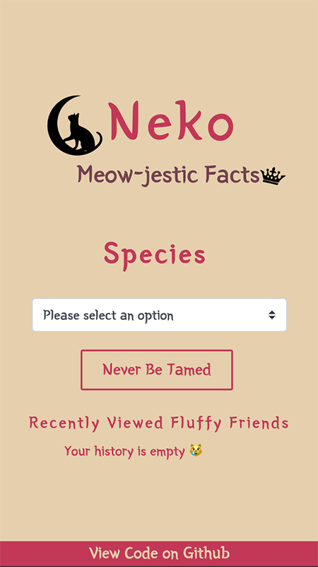

# Neko - Meow-jestic Facts v0.8
### A progressive web-app for cat lovers

This is a showcase project for a coding test interview stage.


## Introduction
This App is a tool which helps to find out more about our furry friends. Returns facts about the selected breed.

### Technologies
  * React
  * Redux
  * Javascript
  * HTML/CSS
  * Bootstrap
  * JSX
  * Git (Version Managed)
  * Hosting (AWS Amplify)

### Features
  * Dropdown menu for selection
  * Validate user selection
  * Loading spinner until API response
  * History for previously viewed pages
  * History check to prevent duplication
  * Responsive Mobile App Design
  * Simplicity in design
  * Touch-friendly
  * Favourite pick (future implementation)

## API
  * TheCatApi - https://thecatapi.com/

## Setup

### Prerequisites
  * Latest version of NPM
  * Command Line
  * IDE of your choice

### Follow the instructions

1. Open your terminal and navigate a directory where you would like to set up your application
2. Run the following command to clone the repository

    ```git clone git@github.com:oliversiket/neko-app.git```

3. Change directory to your freshly cloned app

    ``` cd app-name```

4. Install dependencies
 
    ``` npm install ```

5. Initiate the app

    ``` npm start ```

6. You can visit your app in your browser: http://localhost:3000/

## View the app online
Check out the live version : https://neko.oliversiket.com

### *Feel free to contact me with feedback or if you have any questions*
